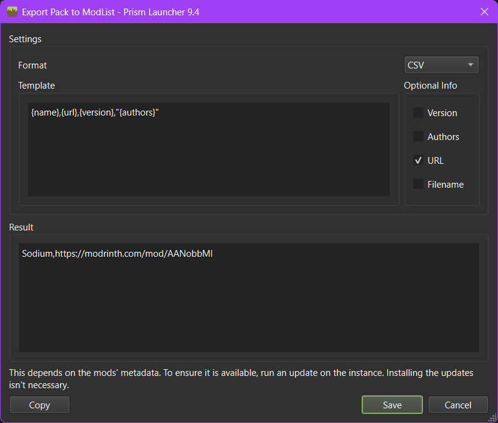
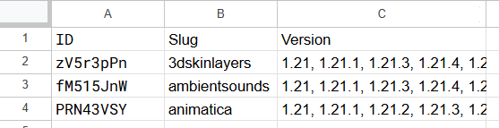

# Get Compatible Minecraft Versions

This is a Python script to search through a mod list from Prism Launcher and find the compatible MC versions that mod has.

## Important Information
This script will **only** work with Modrinth mod ID's. This is because Curseforge's API is not open source, meanwhile Modrinth's API is.

## How to use

### Importing a modlist

>There are multiple ways to import your modlist. Either by replacing the file in the 'modlist' folder, OR copying the mod list into that file. 

First, a correct format is needed. Like in this example below.

The format needs to be set to 'CSV' and the URL selected in 'Optional Info'. From there, you can do either of the next 2 steps.

- Save it as '{modlist_name}.txt' *(This can be named anything.)* in the modlist folder in this repo AND ***delete*** the other file.

OR

- Replace the contents of the file in the 'modlist' folder with your exported mod list. *Make sure there is nothing but the mod list in the file or it will not work.*

###  Altering the Filters

You can alter the filters for specific versions of the game.
E.g., Full versions (aka 1.21), Pre-releases and Snapshots.

> The script automatically filters the versions for 1.21.x only. Meaning no Pre-releases or Snapshots.

You will only need to interact with these lines of code below. You should find them in the 'filterModList' function.

Full versions - `filtered_versions = [x for x in filtered_versions if '1.21' in x]`

- You can change the '1.21' to fit the version you want. E.g., 1.18 or 1.8.

Pre-releases - `filtered_versions = [x for x in filtered_versions if not '-' in x]`

Snapshots - `filtered_versions = [x for x in filtered_versions if not 'w' in x]`

If you want to remove the filters, just comment the lines out. 
>For the people who don't know Python, that is a '#' before the code.

### Transferring into a Spreadsheet

The mod versions come out in a file called 'mod_list.txt'. Each line is in this format: 
>{modID}+{modSlug}+{version1}, {version2}

This format enables you to separate the ID's, Slugs and Versions in a spreadsheet while also keeping the versions in one cell. Example below.

You will need to use a custom separator '+' to do this effectively.